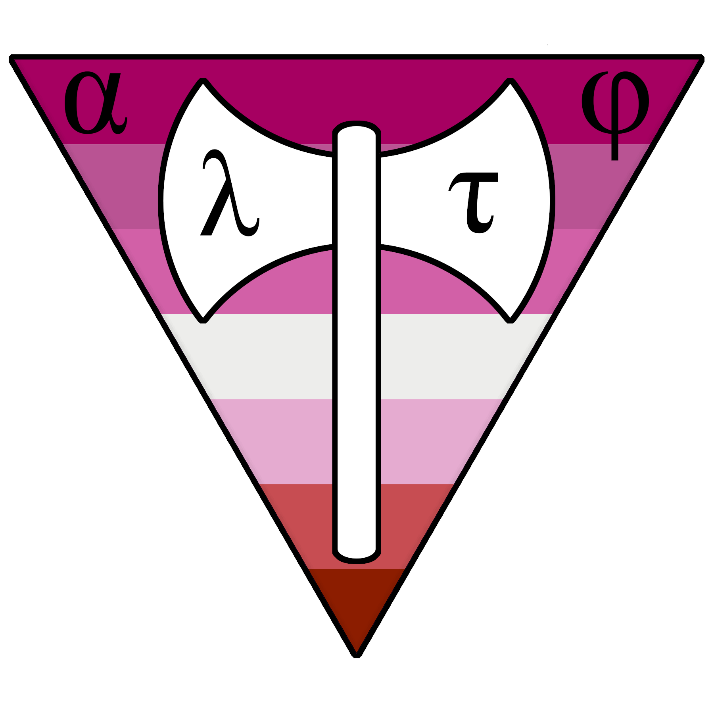

Labrys is a toy language based on LLVM that implements the System Fω type-system.



### Features

* Effects
* Checked exceptions (via effects)
* LLVM backend
* Higher-order polymorphism

### Runtime requirements

* A C compiler: `cc` is used by default

### Build-time requirements

* The latest OPAM and the latest OCaml (https://opam.ocaml.org/)
* Ott (for building documentation only)
* Rubber (for building documentation only)

### Installation

```
$ opam pin add labrys .
```

### Usage

Examples of the syntax or features can be seen in the `examples` directory

To compile an example you have to use the following command:

```
$ labrys build-program examples/Hello.sfw
```

Just replace `Hello` by the name of the module you want to compile (such as `NativeFact` or `Fact`)

Then you can execute the resulting program with:

```
$ ./a.out
```

To know more about the compiler options, use the `--help` argument like:

```
$ labrys --help
$ labrys build-program --help
```


Enjoy !
